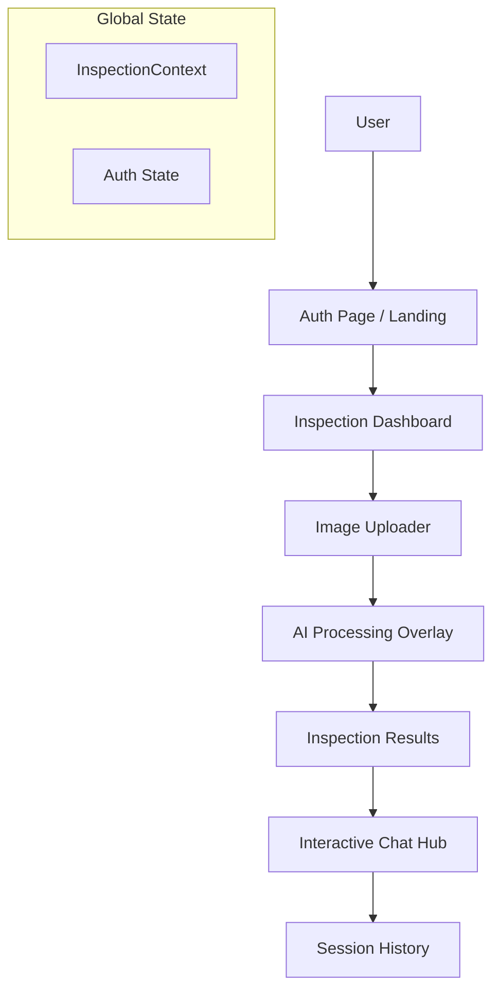

# 🏠 House Inspection AI Assistant — Frontend

A production-grade React application that enables users to upload property images and receive AI-powered defect analysis reports through a conversational interface. Built with a focus on premium aesthetics, smooth interactions, and real-time validation.

🔗 **Live Demo**: [property-inspection-and-repairing-a.vercel.app](https://property-inspection-and-repairing-a.vercel.app)  
🔗 **Backend Repo**: [property_inspection_and_repairing_assistant_backend](https://github.com/suprajasribalaji/property_inspection_and_repairing_assistant_backend)

---

## ✨ Features

- 📸 **Multi-Image Upload**: Seamlessly upload multiple property images for a comprehensive inspection.
- 🤖 **AI-Driven Analysis**: Integration with Groq's Llama 4 Scout vision model for automated defect detection.
- 💬 **Interactive Chat Hub**: Consult with a specialized AI agent about inspection findings and repair advice.
- 🔐 **Advanced Authentication**: JWT-based security with real-time uniqueness validation and password strength indicators.
- ⏳ **Dynamic Progress**: Interactive loading overlays that keep the user informed during complex AI processing.
- 📱 **Responsive & Modern UI**: A premium design system featuring glassmorphism, micro-animations, and a responsive layout.

---

## 🛠️ Tech Stack

| Layer | Technology |
|---|---|
| Framework | React 18 + Vite |
| Language | TypeScript |
| UI Components | shadcn/ui + Lucide Icons |
| State Management | React Context API + TanStack Query |
| Auth | JWT (Stored in LocalStorage) |
| HTTP Client | Axios |
| Routing | React Router v6 |
| Styling | Tailwind CSS |

---

## 🏗️ Architecture



---

## 🔄 Application Flow

1.  **Onboarding**: Users arrive at a premium landing page. The **Sign-Up** process includes real-time checks for username/email availability and password strength rules to ensure account security.
2.  **Property Inspection**:
    *   The user navigates to the **Inspection Dashboard**.
    *   They can upload multiple images (e.g., floor, walls, ceiling).
    *   A **Loading Overlay** provides visual feedback while the backend's LangGraph pipeline analyzes the images.
3.  **Reviewing Results**:
    *   The findings are displayed in a structured format, highlighting detected defects.
    *   Users can view a generated report or proceed to the chat for more details.
4.  **AI Consultation**:
    *   In the **Chat Hub**, users can ask follow-up questions.
    *   The AI uses the specific findings from the inspection to provide tailored repair suggestions.

---

## 🚀 Getting Started

### Prerequisites
- Node.js v18+
- npm, yarn, or pnpm
- Backend server running (see [Backend Repo](https://github.com/suprajasribalaji/property_inspection_and_repairing_assistant_backend))

### Installation

```bash
# Clone the repository
git clone https://github.com/suprajasribalaji/property_inspection_and_repairing_assistant_frontend.git

# Navigate to project directory
cd property_inspection_and_repairing_assistant_frontend

# Install dependencies
npm install
```

### Environment Variables

Create a `.env` file in the root directory:

```env
VITE_API_BASE_URL=http://localhost:8000
VITE_FIREBASE_API_KEY=your_firebase_api_key
VITE_FIREBASE_AUTH_DOMAIN=your_project.firebaseapp.com
VITE_FIREBASE_PROJECT_ID=your_project_id
VITE_FIREBASE_STORAGE_BUCKET=your_project.appspot.com
VITE_FIREBASE_MESSAGING_SENDER_ID=your_sender_id
VITE_FIREBASE_APP_ID=your_app_id
```

### Run Locally

```bash
npm run dev
```

App runs at `http://localhost:5173`

---

## 📁 Project Structure

```
src/
├── components/
│   ├── ui/             # shadcn/ui reusable components
│   ├── Chat/           # Chat interface & panel
│   ├── ImageUpload/    # Multi-image upload logic
│   └── Results/        # Inspection findings visualization
├── pages/
│   ├── Index.tsx       # Landing, Login & Signup
│   ├── ImageAnalysis.tsx # Main dashboard
│   └── ChatPage.tsx    # Q&A interface
├── context/
│   └── InspectionContext.tsx # Global state management
├── services/
│   └── api.ts          # Axios configuration & API calls
└── App.tsx             # Routing & App entry point
```

---

## 🔗 Related

- [Backend Repository](https://github.com/suprajasribalaji/property_inspection_and_repairing_assistant_backend)
- Built with [React](https://reactjs.org) · [Vite](https://vitejs.dev) · [Tailwind CSS](https://tailwindcss.com)